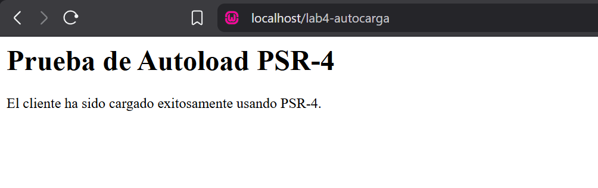

# Laboratorio: Carga Automática (Autoload) bajo el Estándar PSR-4

## Guía de Instalación
Para ejecutar este proyecto de forma local:
1. Clonar el repositorio.
2. Abrir la terminal en la raíz del proyecto.
3. Asegurarse de tener [Composer](https://getcomposer.org/) instalado.
4. En la raíz del proyecto, ejecutar el comando: para que se genere la carpeta `vendor` y el mapa de clases.
5. Abrir `index.php` en un servidor local (WampServer).

## Estructura de Archivos
* `app/Controllers/` -> Contiene las clases (Ej. `ClienteController.php`). Su Namespace es `App\Controllers`.
* `composer.json` -> Archivo de configuración que mapea el prefijo `App\` hacia la carpeta `app/`.
* `index.php` -> Punto de entrada del sistema.

## Evidencias de Funcionamiento
1. Configuración del archivo composer.json

Se muestra la definición del bloque autoload utilizando el estándar PSR-4.

2. Generación del Autoload (Terminal)

Captura de la ejecución del comando composer dump-autoload generando los archivos de optimización.

3. Prueba de Instanciación Exitosa (D.3)

Demostración en el navegador de que la clase fue encontrada e instanciada correctamente sin errores de "Class not found".

## Conclusiones Técnicas (Análisis Comparativo)
Durante el desarrollo de este laboratorio comprobé las siguientes ventajas críticas:
1. **Mantenibilidad:** El sistema es mucho más limpio. Al crear nuevos controladores o modelos para clientes o servicios, ya no es necesario llenar el archivo principal con decenas de líneas `require` o `include`.
2. **Eficiencia de Memoria (Lazy Loading):** PHP solo carga en memoria el archivo `ClienteController.php` en el momento exacto en que se hace el `new ClienteController()`, optimizando el consumo del servidor.
3. **Estandarización:** Utilizar PSR-4 garantiza que la estructura de carpetas y Namespaces sea universal. Cualquier desarrollador que revise el código sabrá instantáneamente dónde buscar la lógica de negocio sin preguntar.

## FOOTER
* **Universidad Tecnológica de Panamá** 
* **Facultad de Ingeniería de Sistemas Computacionales**
* **Licenciatura en Desarrollo y Gestión de Software**
* **Asignatura: Desarrollo de Software VII**
* **Profesora: Ing. Irina Fong**
* **Estudiante: Jeremy Rodríguez**
* **Grupo: 1GS133**
* **Fecha: 29 Abril 2026**